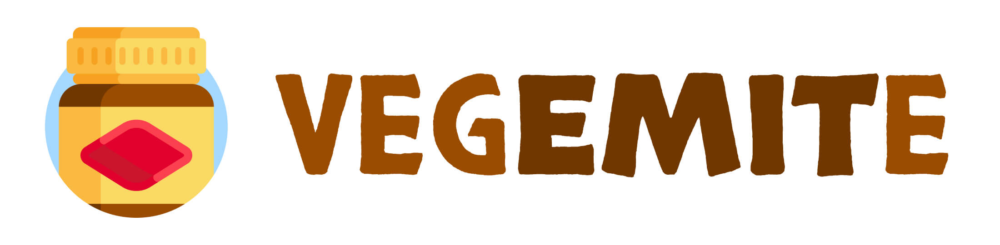

<div align="center">
  
</div>

<div align="center">
  <a href="https://npmjs.org/package/TODO">
    
  </a>
  <a href="https://github.com/lukeed/TODO/actions">
    
  </a>
  <a href="https://codecov.io/gh/lukeed/TODO">
    
  </a>
  <a href="https://npmjs.org/package/TODO">
    
  </a>
</div>

<div align="center">A Pub/Sub state manager you'll love... or hate</div>

## Features

* **Familiar**<br>_Inspired by [Immer](https://github.com/immerjs/immer) and [Redux](https://github.com/reduxjs/redux)_
* **Composable**<br>_Attach/Detach action handlers as needed. Components can bring their own handlers!_
* **Immutability**<br>Modifications or mutations within a handler do not affect state until completion
* **Full [TypeScript Support](#typescript-support)**<br>Utilize TypeScript for in-action guards and validations
* **Extremely lightweight**<br>Weighs only 623 bytes, including dependencies!


## Install

```
$ npm install --save vegemite
```


## Usage

> Check out the [`/examples`](https://github.com/lukeed/vegemite/tree/master/examples) directory for more patterns.

```js
import vegemite from 'vegemite';

const todomvc = vegemite({
	next: 1,
	todos: [],
});

// handler-type: mutate
todomvc.on('todo:add', (state, data) => {
	let nxt = state.next++;
	state.todos.push({
		id: nxt,
		done: false,
		title: data.title,
	});
});

// handler-type: return object
todomvc.on('todo:toggle', (state, id) => {
	let todos = state.todos.map(item => {
		if (item.id === id) item.done = !item.done;
		return item;
	});

	return { next: state.next, todos };
});

// handler-type: return Promise
todomvc.on('todo:assign', async (state, data) => {
	await httpie.send('POST', `/api/todos/${data.id}/assign`, {
		body: { user: data.userid }
	});

	state.todos = state.todos.map(item => {
		if (item.id === data.id) {
			item.assigned = item.assigned || [];
			item.assigned.push(data.userid);
		}
		return item;
	});
});

// Add a global "listener" (side effect)
// This runs _after_ state has been updated
todomvc.listen((state, prev) => {
	console.log('~> this is the NEW state:', state);
	console.log('~> this was the OLD state:', prev);
});
```


## API

### vegemite(state?)
Returns `Vegemite`

Returns a Vegemite instance, pre-filled with an initial state object.

#### state
Type: `State extends any`

Any initial data of your choosing.

### Vegemite.state
Returns: `State`

A getter function that returns a snapshot of the current state.

### Vegemite.on(event, handler)
Returns: `Function`

Assign a new action handler for a specific event.
Returns an unsubscriber function that, when called, will detach this `handler`.

> **Important:** When more than one `handler` exists for an event, they are executed in the order that they were assigned.

```js
let store = vegemite({ count: 5 });

let detach = store.on('count:add', (state, event) => {
	state.count += event.value;
});

await store.dispatch('count:add', { value: 10 });
console.log(store.state); //=> { count: 15 }

detach(); // deactivated

await store.dispatch('count:add', { value: 3 });
console.log(store.state); //=> { count: 15 } (unchanged)
```

#### event
Type: `String`

The event/topic name.

#### handler
Type: `Handler`

See [Handlers](#handlers) below.


### Vegemite.listen(subscriber)<br>Vegemite.listen(event, subscriber)
Returns: `Function`

Attach a new subscription &mdash; when no `event` is specified, then the `subscriber` will listen to _all_ events.

Returns an unsubscriber function that, when called, will detach this `subscriber`.

> **Important:** When more than one `subscriber` exists for an event (or globally), they are executed in the order that they were assigned.

```js
let store = vegemite({ count: 5 });

store.on('increment', state => {
	state.count++;
});

let unlisten = store.listen('increment', (state, prevState) => {
	console.log(`heard increment: ${prevState.count} ~> ${state.count}`);
});

await store.dispatch('increment');
//=> heard increment: 5 ~> 6

unlisten(); // deactivated

await store.dispatch('increment');
// (silence)
```

#### event
Type: `String`

The event/topic name, if any.

#### subscriber
Type: `Subscriber`

See [Subscribers](#subscribers) below.


### Vegemite.set(state, event?)
Returns: `void`

Forcibly set the instance's state.

When `set()` is run, all related subscribers/listeners are called.<br>Optionally pass an `event` to trigger a specific set of listeners.

> **Note:** This is automatically called at the end of a [`dispatch()`](#vegemitedispatchevent-eventdata) chain.

#### state
Type: `State`

The new `State` data.

#### event
Type: `String`

The event/topic on whose behalf you're committing.


### Vegemite.dispatch(event, eventData)
Returns: `Promise<void>`

Sends a new message to an event/topic.

When `dispatch()` is called, all related action handlers (via `on()`) are run to produce a new state. Once this chain is complete, `set()` is invoked with the new state, which will trigger any listeners for the `event` (in addition to global listeners).

> **Attention TypeScript Users:**<br>For events that do not require `eventData`, you must dispatch with an `undefined` payload, or similar.

#### event
Type: `String`

The event/topic to target.

#### eventData
Type: `any`

Any data to send the topic.

> **Important:** Your `eventData` is sent to your event/topic's [handlers](#handlers) as is!


## Handlers

Action handlers can be thought of as "producers" or "reducers" – they are functions that, when matched, are invoked to help create a new state.

Action handlers belong to a specific event and are assigned via `on()`. Multiple handlers may exist for a single event topic. When this is the case, the list of handlers will be executed in the order that they were assigned. This allows handlers to access previous handlers' results and use those as part of its own computation, if desired.

Every handler receives the current `state` as its first parameter and then any `eventData` that was sent to the event (via `dispatch()`). Handlers may return a new `state` object or they may choose to mutate the `state` in place and forgo a return entirely. A `Promise` may also be returned that resolves either to a new state or to a mutation.

```ts
type Handler<T, X> = (state: T, eventData: X) => Promise<T | void> | T | void;
```

While an event's handlers are running (dubbed the "dispatch chain"), you are free to mutate the `state` and `eventData` object _as much as you'd like_ &mdash; mutations have no effect on the instance's actual state during this time! Once the "dispatch chain" has resolved (aka, _all_ handlers have completed), Vegemite will promote the chain's final `state` object as the instance's new actual state (via `set(state, event)`).

At this point, the instance's state has been updated, which means `ctx.state` will reflect the current changes. Additionally, any [subscribers](#subscribers) (via `listen()`) are enqueued for action.

## Subscribers

Subscribers, or listeners, run _after_ the instance has updated its internal state. These can be thought of as "callbacks" or side-effects that, when matched, should be alerted about a change in state.

All subscribers receive the current `state` as its first parameter and the _previous_ state as its second parameter. You can use this information to infer what, specifically, changed between the two state objects. The return value from subscribers has no effect anywhere.

```ts
type Listener<T> = (state: T, prevState: T) => any;
```

Subscribers can listen in on a specific event topic, or they can listen to everything (aka, "global" listeners).

When an event's "dispatch chain" has resolved, any subscribers for that event will be queued in the order that they were assigned. Additionally, all "global" subscribers, if any, will be executed in the order that they were defined. However, please note that **global subscribers always execute before event-specific subscribers.**


## TypeScript Support

Vegemite is made to work with an "EventMap" &mdash; this is an interface whose keys are the names of your events and whose values are the event-datas you expect to pass along as the message. With this information alone, TypeScript and `vegemite` can ensure that **all** of your event publishers and subscribers are passing or expecting the correct data types.

Additionally, `vegemite` requires a `State` descriptor &mdash; this is a separate interface that describes _what_ you want this `vegemite` instance to contain at all times. With this information, TypeScript can ensure your actions/handlers are abiding by the rules & not causing mischief.

```ts
interface Todo {
	id: number;
	done: boolean;
	title: string;
	assigned?: string[];
}

interface Assignment {
	id: Todo['id'];
	userid: string;
}

interface EventMap {
	'todo:add': Todo['title'];
	'todo:toggle': Todo['id'];
	'todo:assign': Assignment;
	// ...
}

interface State {
	next: number;
	todos: Todo[];
}

const todomvc = vegemite<EventMap, State>({
	next: 1,
	todos: []
});
```

With the setup above, TypeScript can help us ensure that the `todo:add` and `todo:toggle` topics will only send or receive their respective `Todo` attributes, whereas the `todo:assign` topic will always send or receive a more complex `Assignment` object.

Meanwhile, any manipulations within the `State` will be protected, ensuring that `state.todos` only contains valid `Todo` objects and `state.next` is always a number.


## License

MIT © [Luke Edwards](https://lukeed.com)
